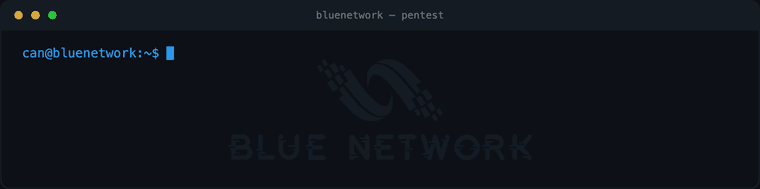
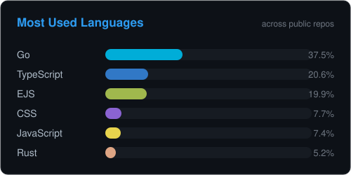
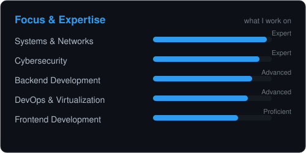
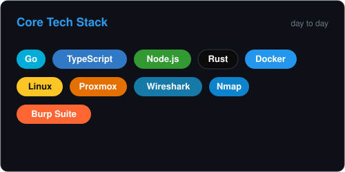

<h1 align="center">
  
</h1>

  
  
  
  

  

## About Me

I'm **Can Sarıhan**, a **Server System & Network Manager** with expertise across backend, frontend, and security. I'm also the founder of **Blue Network**.

- 🔹 **Systems & Networks** — server infrastructure, monitoring, and virtualization (ESXi, Proxmox), from setup to maintenance.
- 🔹 **Development** — I build in **Go**, **TypeScript**, **Node.js / Express**, **Rust**, **EJS**, and **Lua**, across systems tooling and full-stack web.
- 🔹 **Cybersecurity** — web application security, penetration testing, and threat analysis are my core strengths.
- 🔹 **Blue Network** — professional network solutions, security audits, and monitoring at [bluenetwork.tr](https://bluenetwork.tr/).

In short: I build, I secure, I manage. Servers, networks, applications — I handle it all.

## GitHub Stats

  
  &nbsp;
  

  
  &nbsp;
  

<table align="center" width="100%">
<tr>
<td width="50%" align="center"><h3>Server &amp; Network</h3></td>
<td width="50%" align="center"><h3>Cybersecurity</h3></td>
</tr>
<tr>
<td align="center"></td>
<td align="center"></td>
</tr>
<tr>
<td align="center"><em>⚙️ Server and network infrastructure security and monitoring.</em></td>
<td align="center"><em>🛡️ Real-time threat detection &amp; packet analysis.</em></td>
</tr>
</table>

## Languages & Tools

**Languages**

**Backend & Runtime**

**Virtualization**

**Cybersecurity**

## Featured Projects

A suite of network and systems tools, each with a live panel and green CI. Click a banner to open the repo.

  <a href="https://github.com/cansarihan/aegis"><picture><source media="(prefers-color-scheme: dark)" srcset="https://raw.githubusercontent.com/cansarihan/aegis/main/docs/assets/wordmark-dark.svg"></picture></a>

  <a href="https://github.com/cansarihan/ark"><picture><source media="(prefers-color-scheme: dark)" srcset="https://raw.githubusercontent.com/cansarihan/ark/main/docs/assets/wordmark-dark.svg"></picture></a>
  <a href="https://github.com/cansarihan/rampart"><picture><source media="(prefers-color-scheme: dark)" srcset="https://raw.githubusercontent.com/cansarihan/rampart/main/docs/assets/wordmark-dark.svg"></picture></a>

  <a href="https://github.com/cansarihan/warden"><picture><source media="(prefers-color-scheme: dark)" srcset="https://raw.githubusercontent.com/cansarihan/warden/main/docs/assets/wordmark-dark.svg"></picture></a>
  <a href="https://github.com/cansarihan/ballast"><picture><source media="(prefers-color-scheme: dark)" srcset="https://raw.githubusercontent.com/cansarihan/ballast/main/docs/assets/wordmark-dark.svg"></picture></a>

  <a href="https://github.com/cansarihan/prowl"><picture><source media="(prefers-color-scheme: dark)" srcset="https://raw.githubusercontent.com/cansarihan/prowl/main/docs/assets/wordmark-dark.svg"></picture></a>
  <a href="https://github.com/cansarihan/reliquary"><picture><source media="(prefers-color-scheme: dark)" srcset="https://raw.githubusercontent.com/cansarihan/reliquary/main/docs/assets/wordmark-dark.svg"></picture></a>

  <a href="https://github.com/cansarihan/sift"><picture><source media="(prefers-color-scheme: dark)" srcset="https://raw.githubusercontent.com/cansarihan/sift/main/docs/assets/wordmark-dark.svg"></picture></a>
  <a href="https://github.com/cansarihan/cipher"><picture><source media="(prefers-color-scheme: dark)" srcset="https://raw.githubusercontent.com/cansarihan/cipher/main/docs/assets/wordmark-dark.svg"></picture></a>

  <a href="https://github.com/cansarihan/quarry"><picture><source media="(prefers-color-scheme: dark)" srcset="https://raw.githubusercontent.com/cansarihan/quarry/main/docs/assets/wordmark-dark.svg"></picture></a>
  <a href="https://github.com/cansarihan/argus"><picture><source media="(prefers-color-scheme: dark)" srcset="https://raw.githubusercontent.com/cansarihan/argus/main/docs/assets/wordmark-dark.svg"></picture></a>

  <a href="https://github.com/cansarihan/falcon"><picture><source media="(prefers-color-scheme: dark)" srcset="https://raw.githubusercontent.com/cansarihan/falcon/main/docs/assets/wordmark-dark.svg"></picture></a>
  <a href="https://github.com/cansarihan/tempo"><picture><source media="(prefers-color-scheme: dark)" srcset="https://raw.githubusercontent.com/cansarihan/tempo/main/docs/assets/wordmark-dark.svg"></picture></a>

  <a href="https://github.com/cansarihan/cordon"><picture><source media="(prefers-color-scheme: dark)" srcset="https://raw.githubusercontent.com/cansarihan/cordon/main/docs/assets/wordmark-dark.svg"></picture></a>
  <a href="https://github.com/cansarihan/vane"><picture><source media="(prefers-color-scheme: dark)" srcset="https://raw.githubusercontent.com/cansarihan/vane/main/docs/assets/wordmark-dark.svg"></picture></a>

  <a href="https://github.com/cansarihan/pharos"><picture><source media="(prefers-color-scheme: dark)" srcset="https://raw.githubusercontent.com/cansarihan/pharos/main/docs/assets/wordmark-dark.svg"></picture></a>
  <a href="https://github.com/cansarihan/lattice"><picture><source media="(prefers-color-scheme: dark)" srcset="https://raw.githubusercontent.com/cansarihan/lattice/main/docs/assets/wordmark-dark.svg"></picture></a>

  <a href="https://github.com/cansarihan/wharf"><picture><source media="(prefers-color-scheme: dark)" srcset="https://raw.githubusercontent.com/cansarihan/wharf/main/docs/assets/wordmark-dark.svg"></picture></a>
  <a href="https://github.com/cansarihan/anvil"><picture><source media="(prefers-color-scheme: dark)" srcset="https://raw.githubusercontent.com/cansarihan/anvil/main/docs/assets/wordmark-dark.svg"></picture></a>

  <a href="https://github.com/cansarihan/sonar"><picture><source media="(prefers-color-scheme: dark)" srcset="https://raw.githubusercontent.com/cansarihan/sonar/main/docs/assets/wordmark-dark.svg"></picture></a>
  <a href="https://github.com/cansarihan/prism"><picture><source media="(prefers-color-scheme: dark)" srcset="https://raw.githubusercontent.com/cansarihan/prism/main/docs/assets/wordmark-dark.svg"></picture></a>

## Blue Network

**[Blue Network](https://bluenetwork.tr/)** — network infrastructure, security audits, and monitoring solutions.

  

